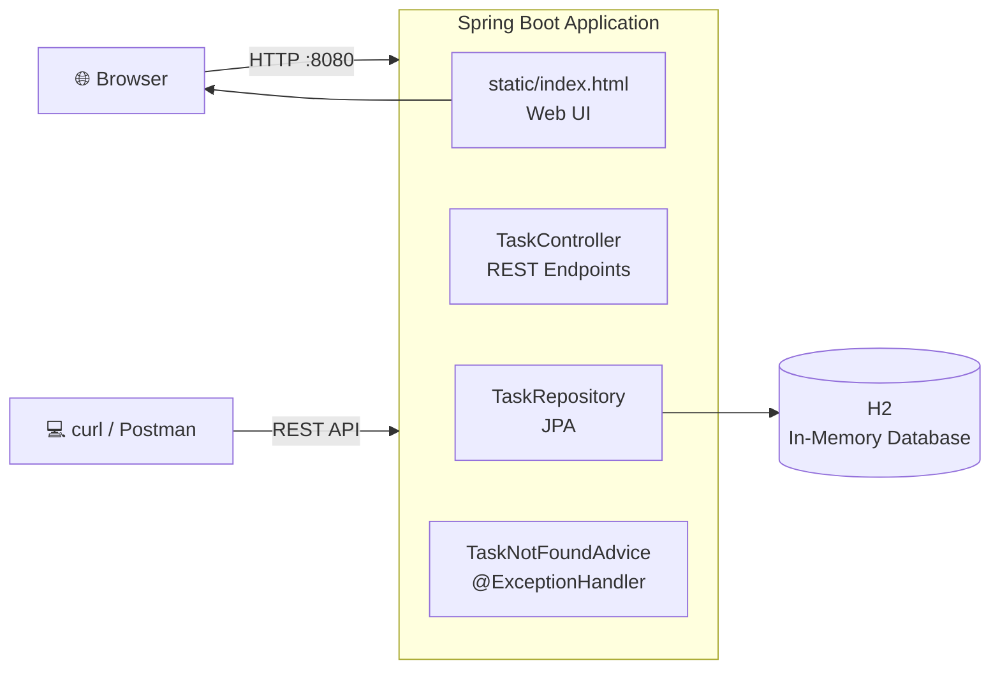
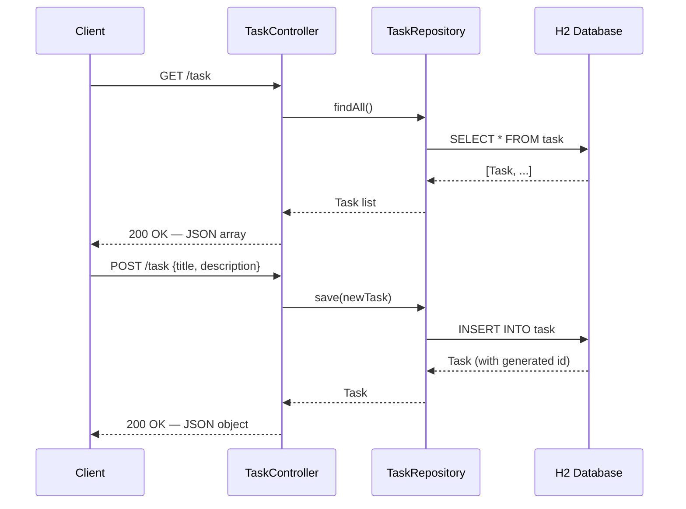
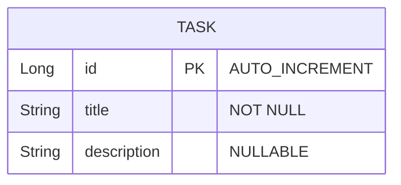

# Task Manager API


A lightweight REST API for task management with a built-in web UI. Built with Spring Boot and designed for simplicity —  external database integration in progress.

- **RESTful API** — full CRUD operations with JSON
- **Web UI** — vanilla HTML/CSS/JS interface at `/`
- **H2 Database** — in-memory, zero configuration
- **Network-ready** — accessible from any device on your LAN

---

## Table of Contents

- [Getting Started](#getting-started)
- [Architecture](#architecture)
- [API Reference](#api-reference)
- [Web Interface](#web-interface)
- [Configuration](#configuration)
- [Project Structure](#project-structure)
- [Building](#building)
- [License](#license)

---

## Getting Started

### Prerequisites

| Tool | Version | Installation |
|------|---------|-------------|
| Java | 25+ | [jdk.java.net/25/](https://jdk.java.net/25/) |
| Maven | 3.9+ | Bundled as `./mvnw` |

### Quick Start

```bash
git clone https://github.com/<your-user>/task-manager.git
cd task-manager
./mvnw spring-boot:run
```

Open **http://localhost:8080** in your browser.

> **Network access:** The server binds to `0.0.0.0`. From another device on the same LAN use `http://<YOUR_LOCAL_IP>:8080`.

---

## Architecture

### Layer Diagram



### Request Flow



### Entity-Relationship



| Field | Type | Constraints | Description |
|-------|------|-------------|-------------|
| `id` | `Long` | PK, Auto-generated | Unique identifier |
| `title` | `String` | `NOT NULL` | Task name |
| `description` | `String` | Nullable | Optional details |

---

## API Reference

Base URL: `http://localhost:8080`

### `GET /task`

Returns all tasks.

| | |
|---|---|
| **Response** | `200 OK` — `List&lt;Task&gt;` |

```bash
curl http://localhost:8080/task
```

```json
[
  {
    "id": 1,
    "title": "Buy groceries",
    "description": "Milk, eggs, bread"
  }
]
```

---

### `POST /task`

Creates a new task.

| | |
|---|---|
| **Request body** | `{ "title": "string (required)", "description": "string (optional)" }` |
| **Response** | `200 OK` — `Task` with assigned `id` |

```bash
curl -X POST http://localhost:8080/task \
  -H "Content-Type: application/json" \
  -d '{"title": "Write report", "description": "Q3 financial summary"}'
```

```json
{
  "id": 2,
  "title": "Write report",
  "description": "Q3 financial summary"
}
```

---

### `GET /task/{id}`

Returns a single task by ID.

| | |
|---|---|
| **Path parameter** | `id` — `Long` |
| **Response 200** | `Task` |
| **Response 404** | `{ "error": "Could not find task {id}" }` |

```bash
curl http://localhost:8080/task/1
```

```json
{
  "id": 1,
  "title": "Buy groceries",
  "description": "Milk, eggs, bread"
}
```

```bash
curl http://localhost:8080/task/99
```

```json
{
  "error": "Could not find task 99"
}
```

---

### `PUT /task/{id}`

Replaces an existing task (full update). If the task does not exist, it is created.

| | |
|---|---|
| **Path parameter** | `id` — `Long` |
| **Request body** | `{ "id": Long, "title": "string", "description": "string" }` |
| **Response** | `200 OK` — Updated `Task` |

```bash
curl -X PUT http://localhost:8080/task/2 \
  -H "Content-Type: application/json" \
  -d '{"id": 2, "title": "Write final report", "description": "Q3 financial summary – updated"}'
```

```json
{
  "id": 2,
  "title": "Write final report",
  "description": "Q3 financial summary – updated"
}
```

---

### `DELETE /task/{id}`

Deletes a task by ID.

| | |
|---|---|
| **Path parameter** | `id` — `Long` |
| **Response** | `200 OK` — no body |

```bash
curl -X DELETE http://localhost:8080/task/1
```

---

## Web Interface

Open **http://localhost:8080** in your browser.

- **Add** a task using the form at the top
- **Edit** inline by clicking the *Edit* button
- **Delete** with confirmation via the *Delete* button
- **Keyboard shortcuts:** `Enter` to submit, `Escape` to cancel editing

---

## Configuration

File: `src/main/resources/application.properties`

| Property | Default | Description |
|----------|---------|-------------|
| `server.port` | `8080` | Web server port |
| `server.address` | `0.0.0.0` | Bind address |

> **Note:** Persistent database integration (PostgreSQL/MySQL) is in progress. Currently using H2 in-memory — data is lost on restart.

**Change port:**

```properties
server.port=9090
```

**Persist data to disk (default is in-memory):**

```properties
spring.datasource.url=jdbc:h2:file:./data/taskmanager
```

---

## Project Structure

```
src/main/java/com/example/task_manager/
├── Task.java                     # JPA entity
├── TaskController.java           # REST controller
├── TaskRepository.java           # Spring Data repository
├── TaskNotFoundException.java    # Custom 404 exception
├── TaskNotFoundAdvice.java       # Global error handler
├── TaskManagerApplication.java   # Application entry point
└── LoadDatabase.java             # Demo data seeder

src/main/resources/
├── static/
│   ├── index.html                # Web UI
│   └── styles.css                # Stylesheet
└── application.properties        # Configuration
```

---

## Building

Generate a production JAR:

```bash
./mvnw package
java -jar target/task-manager-0.0.1-SNAPSHOT.jar
```

---

## License

This is free and unencumbered software released into the public domain. See [LICENSE](LICENSE) for details.
